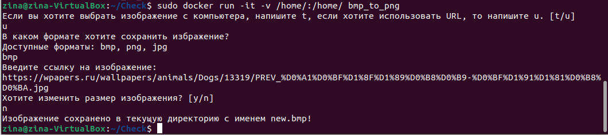

# BMP-to-PNG Converter
## Описание
Консольная утилита, позволяющая конвертировать изображения из одного формата в другой формат.


## Возможности:
- **Конвертация изображения из одного формата в другой** - основная возможность проекта, доступные форматы: `.bmp`, `.png`, `.jpg`.

- **Множественная конвертация** — если пользователь выбирает файл(ы) с компьютера, то появляется возможность множественной конвертации, то есть все изображения с указанным форматом сохраняются в новом выбранном формате.

- **Изменение разрешения** - пользователь может выбрать, оставить ли изображение в исходном разрешении или сжать/расширить результат относитьльно исходного.

- **Возможность сохранения изображения по ссылке** - пользователь может сохранить изображение по ссылке в одном из доступных форматов, оставив или изменив его разрешение.

## Как запустить проект:

Клонировать репозиторий и перейти в него в командной строке:
```
git clone https://github.com/zina-frid/BMP-to-PNG.git
```
```
cd BMP-to-PNG/
```
### ***Обычный запуск***

Запустить программу:
```
python3 main.py
```
Чтобы успешно выполнить конвертацию и сохрание изображений, необходимо отвечать на вопросы, появлющиеся в терменале, одним из предлагаемых вариантов.

### ***Запуск через Docker***
Для получения работающего сервиса необходимо запустить следующие команды:

Запуск процесса сборки:
```
sudo docker build -t bmp_to_png .
```
Запуск собранного образа:
```
sudo docker run -it -v /home/:/home/ bmp_to_png
```

## Технические требования
Все необходимые пакеты перечислены в ```requirements.txt```

## Пример запуска сервиса в докере

*Пример с выбором файлов с компьютера, множественной конвертацией и измененением разрешений изображений до 80% от исходного размера:*


*Пример с сохранением изображения по ссылке в выбранном формате `.bmp` без изменения размера:*

