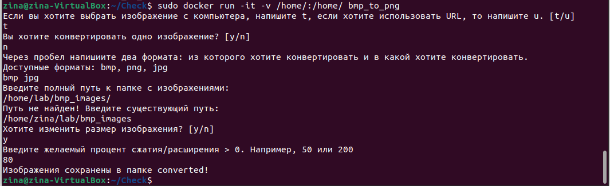
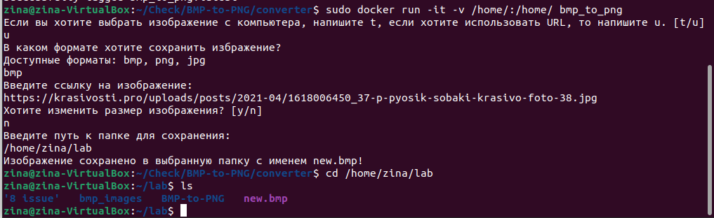
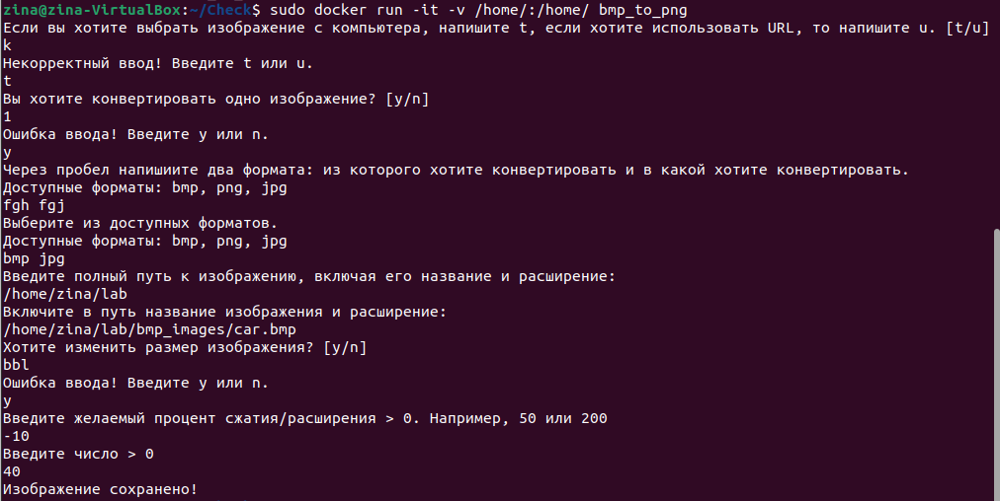
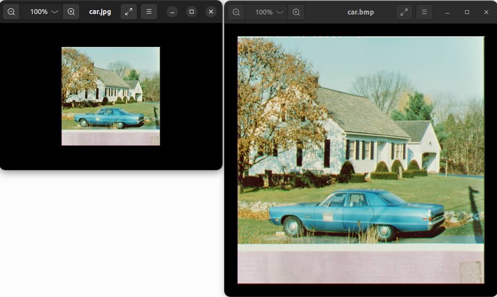

# BMP-to-PNG Converter
## Описание
Консольная утилита, позволяющая конвертировать изображения из одного формата в другой формат.


## Возможности:
- **Конвертация изображения из одного формата в другой** - основная возможность проекта, доступные форматы: `.bmp`, `.png`, `.jpg`.

- **Множественная конвертация** — при выборе файлов с компьютера появляется возможность выбора множественной конвертации, то есть все изображения с указанным форматом сохраняются в новом выбранном формате.

- **Изменение разрешения** - пользователь может выбрать, оставить ли изображение в исходном разрешении или сжать/расширить результат относитьльно исходного.

- **Возможность сохранения изображения по ссылке** - пользователь может сохранить изображение по ссылке в одном из доступных форматов, оставив или изменив его разрешение.

## Как запустить проект:

Клонировать репозиторий и перейти в него в командной строке:
``` console
$ git clone https://github.com/zina-frid/BMP-to-PNG.git
```
``` console
$ cd BMP-to-PNG/converter
```
### ***Обычный запуск***

Запустить программу:
``` console
$ python3 main.py
```
Чтобы успешно выполнить конвертацию и сохрание изображений, необходимо отвечать на вопросы, появляющиеся в терминале, одним из предлагаемых вариантов.

### ***Запуск через Docker***
Для получения работающего сервиса необходимо запустить следующие команды:

Запуск процесса сборки:
``` console
$ sudo docker build -t bmp_to_png .
```
Запуск собранного образа:
``` console
$ sudo docker run -it -v /home/:/home/ bmp_to_png
```

## Технические требования
Все необходимые пакеты перечислены в ```converter/requirements.txt```

## Пример запуска сервиса в докере

*Пример с выбором файлов с компьютера, множественной конвертацией и измененением разрешений изображений до 80% от исходного размера:*



*Пример с сохранением изображения по ссылке в выбранном формате `.bmp` без изменения размера:*




*Пример с обработкой некорректного ввода:*




*Сравнение результата (слева) и исходного изображения (справа), изменен формат и разрешение до 40% от исходного:*


